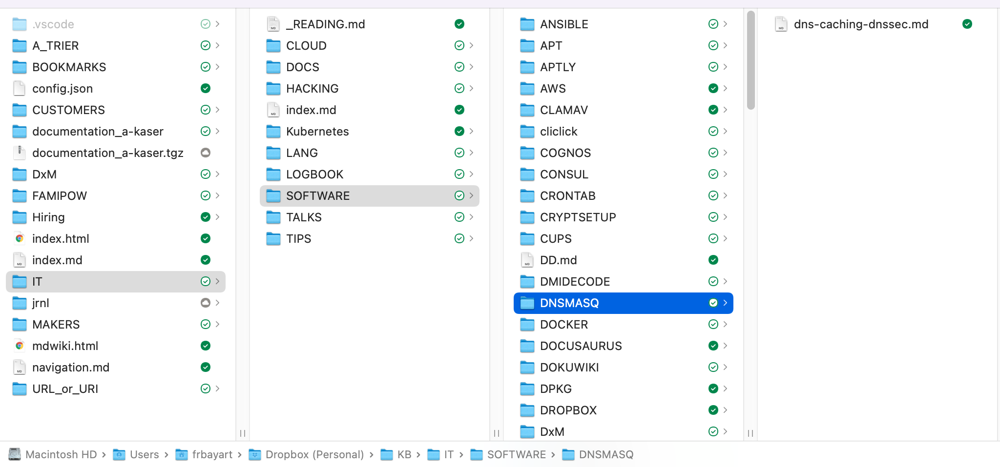
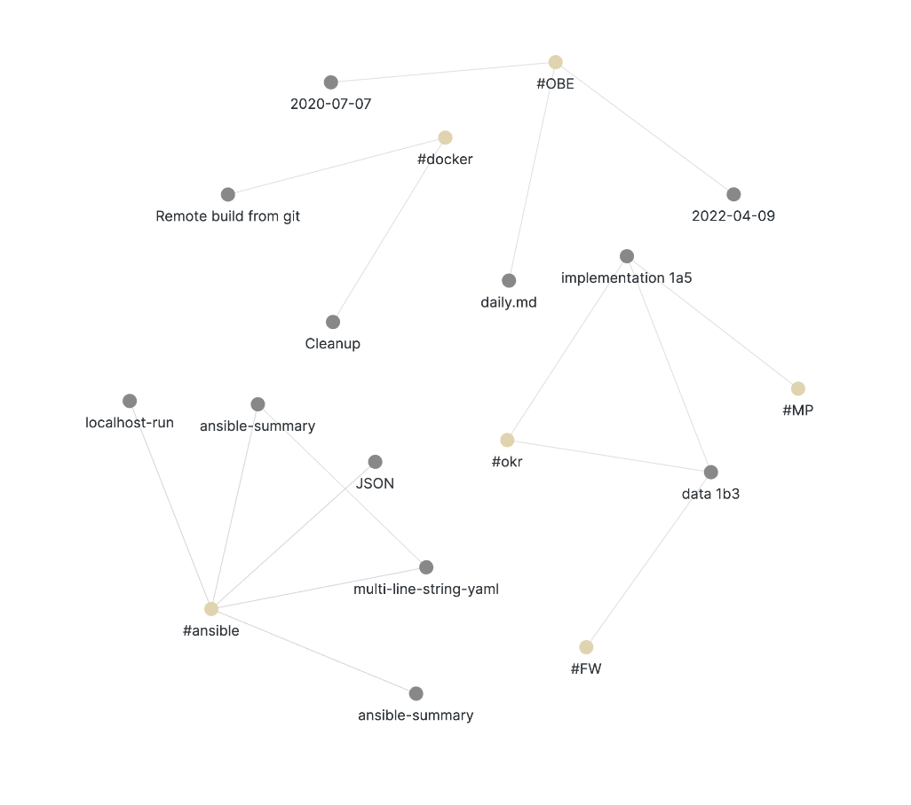

Au fil de la journée nous avons tendance à copier/coller des commandes, liens ou textes qui peuvent nous êtres utiles par la suite; et lorsqu'il est question d'informatinos techniques cela arrive non-stop:

<!--truncate-->

- un fichier texte qui grossit d'années en années (grep lover)
- Evernote
- des fichiers textes classés par thématiques
- évolution des fichiers textes en fichiers Markdown
- Notion

Je suis passé par toutes ces étapes et bien plus encore (wiki...), celui qui fonctionne le mieux pour ma part est un répertoire Dropbox nommé __KB__ (Knowledge Base) dans lequel s'enchaine une multitude de sous répertoires pour "essayer" de classer tout cela avant d'arriver aux fichiers contenant mes notes.

L'avantage pour ma part c'est l'accès rapide à l'information (local) mais que ça reste accessible de partout (Cloud).

Certes les applications comme Notes, Evertnote ou Notion sont plus puissantes (import de ressources, intégration à des outils tiers, recherche et collaboration) mais au final ce n'est pas important à mes yeux pour des instructions ou l'évolution est moins fréquente et la collaboration rarement synchrone.

Obsidian, [SimpleNote](https://simplenote.com/?ref=creative-gooses) , [nvALT](https://brettterpstra.com/projects/nvalt/?ref=famipow)

C'est le moyen le plus efficace

docusaurus

Et vous quel est votre système de gestion de connaissances techniques?